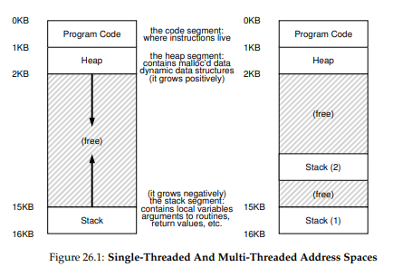
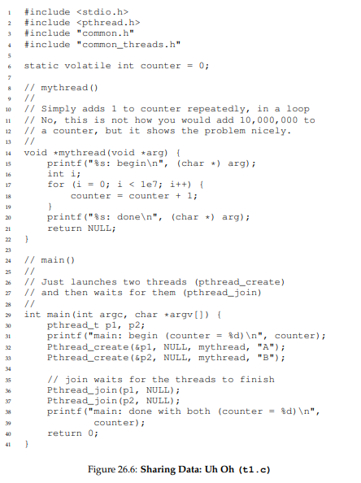
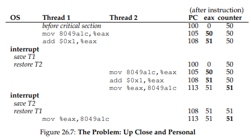

# 병행성: 개요

이번 장부터는 **쓰레드(thread)** 에 대해 다룬다. 한 순간에 하나의 명령어만을 실행하는(단일 PC 값) 관점에서 벗어나 멀티 쓰레드 프로그램은 하나 이상의 실행 지점(독립적으로 호출 가능한 여러 개의 PC 값)을 가지고있다. 프로세스와 쓰레드가 비슷해 보이지만 쓰레드는 같은 주소 공간을 공유하기 때문에 동일한 값에 접근할 수 있다는 것이다.

만약 2개의 쓰레드가 하나의 프로세서에서 실행 중이라면 실행하고자 하는 쓰레드(T2)는 반드시 **문맥 교환(context switching)** 을 통해서 실행 중인 쓰레드(T1)와 교체 되어야 한다. 프로세스가 문맥 교환을 할 때에 프로세스 제어 블럭(process control block, PCB)에 저장하듯이 프로세스의 쓰레드들의 상태를 저장하기 위해 **쓰레드 제어 블럭(thread control block, TCB)** 이 필요하다. 



프로세스와 스레드의 또 다른 차이는 스택에 있다. 단일 쓰레드 프로세스에는 스택이 하나만 존재하는 반면 멀티 쓰레드 프로세스는 각 쓰레드가 독립적으로 실행되고 여러 루틴을 호출하기 떄문에 쓰레드마다 스택이 할당되어 있다.

# 왜 쓰레드를 사용하는가?

쓰레드를 사용하는 데에는 2가지 주요한 이유가 있다.

첫번째는 **병렬 처리(parallelism)** 이다. 예를 들어 두 개의 큰 배열을 더하는 등 매우 큰 배열을 대상으로 연산한다고 가정하자. 단일 프로세서에서 실행하면 작업을 하나씩 수행하고 완료 하면 된다. 하지만 멀티프로세서 시스템에서 실행하면 각 프로세서가 작업의 일부분을 수행하게 함으로써 실행의 속도를 상당히 높일 수 있다. **단일 스레드** 프로그램을 멀티프로세서 상에서 같은 작업을 하게 만드는 작업을 **병렬화(parellelization)** 라고 한다.

두번째는 약간 미묘하긴 하지만 느린 I/O로 인해 프로그램 실행이 멈추지 않도록 하기 위해 쓰레드를 사용한다. I/O를 하는 동안 기다리는 대신 CPU가 다른 쓰레드로 연산을 하도록 하게 할 수 있다. 쓰레딩은 하나의 프로그램 안에서 I/O와 다른 작업이 **중첩(overlap)** 될 수 있게 한다. 이는 **멀티프로그래밍(multiprogramming)** 하는 것과 비슷하다.

결과적으로 많은 서버 기반 응용프로그램(웹 서버, DBMS 등)을 구현할 때 쓰레드를 사용한다.

# 훨씬 더 어려운 이유: 데이터의 공유

쓰레드의 실행 순서는 스케줄러의 동작에 따라 바뀔 수도 있다.



위의 코드를 실행시키면 딱 20,000,000이 나올 것으로 그대할 수 있다. 하지만 현실은 그렇지 않다. 19,124,234나 19,745,129와 같은 값이 나올 것이다. 그 이유는 다음에서 다룬다.

# 문제의 핵심: 제어 없는 스케줄링

왜 이런 현상이 발생하는지 이해하려면 캄퍼일러의 코드 실행 순서를 알아야 한다.

x86에서 counter를 증가하는 코드의 순서는 다음과 같다.

```assembly
mov 0x8049a1c, %eax
add $0x1, %eax
mov %eax, 0x8049a1c
```

두 개의 쓰레드 중에 T1이 counter의 값을 증가시키는 영역에 진입했다고 가정하자.
- T1이 counter의 값을 eax에 복사하고 1을 증가 시켰다.
- 그때 T2가 counter의 값을 증가시키는 영역에 진입하여 counter의 값을 복사한다면 아직 변하지 않은 값을 복사할 것이다.
- 그리고 T1이 1 증가된 eax의 값을 counter에 복사한다.
- T2가 eax에 +1 하여 counter에 넣더라도, 결과적으로는 counter가 1밖에 증가하지 않았다.



"정확하게" 동작하도록 작성된 프로그램이면 값이 2가 증가해야 됐다.

예시와 같이 명령어의 실행 순서에 따라 결과가 달라지는 상황을 **경쟁 조건(race condition)** 이라고 혹은 더 구체적으로 **데이터 경쟁(data race)** 이라고 부른다. 컴퓨터에서 일반적으로 발생하는 **결정적** 결과와 달리 결과가 어떠할지 알지 못하거나 실행할 때 마다 결과가 달라지는 경우를 **비결정적(indeterminate)** 인 결과라고 부른다.

멀티 쓰레드가 같은 코드를 실행할 때 경쟁 조건이 발생하기 때문에 이러한 코드 부분을 **임계 영역(critical section)** 이라고 부른다. 공유 변수(혹은 공유 자원)에 접근하고 두 개 이상의 쓰레드에서 동시에 실행되면 안 되는 코드를 임계 영역이라 부른다.

이러한 코드에서 필요한 것은 **상호 배제(mutual exclusion)** 이다. 하나의 쓰레드가 임계 영역 내의 코드를 실행 중일 때는 다른 쓰레드가 실행할 수 없도록 보장해준다.

# 원자성에 대한 바람

임계 영역 문제에 대한 해결 방법 중 하나로 강력한 명령어 한 개로 의도한 동작을 수행하여 인터럽트 발생 가능성을 차단하는 것이다. 그러나 일반적인 상황에선 그게 쉽지 않다.

따라서 하드웨어에 **동기화 함수(synchronization primitives)** 구현에 필요한 몇 가지 유용한 명령어를 요청하는 것이다. 하드웨어의 지원과 OS의 도움을 받아 한번에 하나의 쓰레드만 임계 영역에서 실행하도록 "제대로 잘 작동하는" 멀티 쓰레드 프로그램을 작성할 수 있다.
