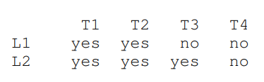
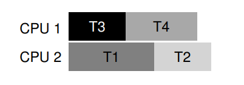
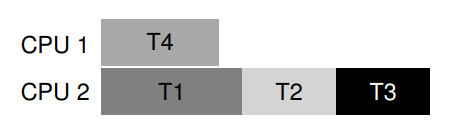

# 병행성 관련 버그

# 교착 상태는 왜 발생하는가

소프트웨어 개발자들은 소프트웨어 모듈화가 개발을 쉽게 하기 떄문에 상세한 구현 내용을 감추고자 한다. 이는 **캡슐화(encapsulation)** 의 성질이다. 하지만 모듈화와 락은 잘 조화되지 않는다.

## 교착 상태 발생 조건

교착 상태가 발생하기 위해서는 네 가지 조건이 모두 충족되어야 한다.

- **상호 배제(Mutual Exclusion)**: 쓰레드가 자신이 필요로 하는 자원에 대한 독자적인 제어권을 주장한다.
- **점유 및 대기(Hold-and-wait)**: 쓰레드가 자신에게 할당된 자원을 점유한 채로 다른 자원을 대기한다.
- **비 선점(No preemption)**: 자원(락)을 점유하고 있는 쓰레드로부터 자원을 강제적으로 빼앗을 수 없다.
- **환형 대기(Circular wait)**: 각 쓰레드는 다음 쓰레드가 요청한 하나 또는 그 이상의 자원을 갖고 있는 쓰레드들의 순환 고리가 있다.

이 네 조건중 하나라도 만족하지 않는다면 교착 상태는 발생하지 않는다.

# 교착 상태의 예방

## 순환 대기

가장 실용적이고 자주 사용되는 교착 상태 예방 기법은 순환 대기가 발생하지 않도록 하는 것이다. 그 방법으로 락을 획득하는 **전체 순서(total ordering)** 을 정하는 것이다. L2를 획득하기 전에 L1을 획득하는 등 순서를 따르면 순환 대기는 발생하지 않고 교착 상태도 발생하지 않는다.

복잡한 시스템에서는 모든 락에 대해 순서를 정하는 것이 쉽지 않을 수 있다. 이 경우 **부분 순서(partial ordering)** 를 정의할 수도 있다.

하지만 전체 순서 또는 부분 순서를 이용해 락을 제어할 때에는 주의해야 한다. 단순한 코딩 규칙에 불과하기 때문에 익숙하지 않은 개발자들이 관례를 무시하여 교착 상태가 발생할 수 있다.

## 점유 및 대기(Hold-and-Wait)

점유 및 대기는 원자적으로 모든 락을 한번에 획득하도록 하면 예방할 수 있다. 실제로 다음과 같이 사용한다.

```c
pthread_mutex_lock(prevention);
pthread_mutex_lock(L1);
pthread_mutex_lock(L2);

pthread_mutex_unlock(prevention);
```

이 해법은 문제점이 많다. 필요한 락을 정확히 파악해서 미리 획득해야 하고 실제 필요할 때 요청하는 것이 아닌 미리 모든 락을 획득하기 떄문에 병행성이 저하되는 문제도 있다.

## 비선점(No Preemption)

락을 한번 획득하게 되면 이를 명시적으로 반납하기 전까지는 락을 보유하고 있는 것이 문제가 된다. 많은 쓰레드 라이브러리들은 이 상황을 피할 수 있는 인터페이스들을 제공한다. 특히 pthread_mutex_try_lock() 루틴은 락이 획득가능하면 락을 획득하고 성공을 반환한다. 만약 락이 점유 중이었다면 에러 코드를 반환한다.

```c
top:
    pthread_mutex_lock(L1);
    if (pthread_mutex_trylock(L2) != 0) {
        pthread_mutex_unlock(L1);
        goto top;
    }
```

하지만 이 방식에서는 **무한반복(livelock)** 이라는 새로운 문제가 생긴다. 계속해서 코드는 실행하지만(그래서 교착 상태는 아니다.) 결과적으로는 진척이 되지 않는다. 이 무한반복을 해결하기 위해 락 획득을 위한 코드를 반복하기 전에 임의의 시간 동안 지연하여 경쟁 쓰레드 간의 반복 간섭 확률을 줄일 수 있다.

이 접근법은 선점 기능을 추가하지는 않는다. 하지만 락 획득에 실패했을 경우 무조건 대기하지 않고 그로부터 벗어나기 위해 trylock을 사용한다.

## 상호 배제(Mutual Exclusion)

마지막은 상호 배제 자체를 없애는 방법이다. 그렇다면 어떻게 임계 영역을 제어해야 할까?

Herlihy가 제안한 자료구조는 **락이 없는(lock-free)** 자료구조이다. 강력한 하드웨어 명령어를 사용해 명시적인 락 없이도 접근할 수 있는 자료구조를 만들 수 있다는 것이다.

간단한 예로 Compare-And-Swap을 들 수 있다. 이 명령은 하드웨어가 지원하는 원자적 명령어를 다루 때 살표보았다.

```c
int CompareAndSwap(int *address, int expected, int new) {
    if (*address == expected) {
        *address = new;
        return 1; // success
    }
    return 0; // failure
}
void AtomicIncrement(int *value, int amount) {
    do {
        int old = *value;
    } while (CompareAndSwap(value, old, old + amount) == 0);
}

```

락을 획득하여 값을 갱신한 후에 락을 해제하는 대신 Compare-And-Swap 명령어를 사용하여 값에 새로운 값을 갱신하도록 반복적으로 시도한다.

## 스케줄링으로 교착 상태 회피하기

어떤 시나리오에서는 교착 상태를 예방하는 대신 **회피**하는 것이 더 유용할 때가 있다. 회피하기 위해서는 실행 중인 쓰레드가 어떤 락을 획득하게 될 것인지를 파악해야 하고 그것을 바탕으로 쓰레드를 스케줄링하여 교착 상태가 발생하지 않도록 그때그때 보장한다.



위 이미지는 쓰레드들이 L1와 L2 락을 필요하는지에 대해 정리한 표이다. 이 상황에서 스케줄러는 T1과 T2를 동시에 실행하지 않을 것이다. 그래야 교착 상태가 발생하지 않는다.



만약 T3가 L1락 까지 필요하다고 하면 CPU는 다음과 같이 스케줄링 할 것이다.



정적 스케줄링은 T1~T3까지 전부 하나의 프로세서에서 실행되도록 하였다. 작업시간은 굉장히 오래걸리겠지만, 교착 상태가 발생할 수 있기 때문에 보수적인 방법을 택한 것이다.

따라서 스케줄링으로 교착 상태를 회피하는 것은 보편적으로 사용되는 방법은 아니다.

## 발견 및 복구

마지막 전략은 교착 상태를 허용하고 발견해서 복구하는 방법이다. 예를 들어 OS가 1년에 한번 멈춘다고 하면 그저 재부팅을 하여 다시 작업을 처리하는 식이다. 아주 가끔 발생한다면 이 방법도 가능하다.

많은 데이터베이스 시스템이 교착 상태를 발견하고 회복하는 기술을 사용한다. 자원 할당 그래프를 그려 사이클이 생겼는지 검사하고, 사이클이 발생하는 경우(교착 상태인 경우) 시스템은 재부팅 되어야 한다. 자료 구조에 대해 복잡한 복구가 필요한 경우 사람이 직접 복구 작업을 해야할 수 있다.
