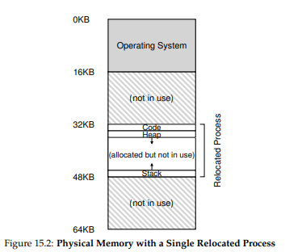

# 주소 변환의 원리

**하드웨어 기반 주소변환(harware-based address translation)** 또는 **주소 변환(address translation)** 이라 불리는 이 기술은 **가상** 주소를 정보가 실제로 존재하는 **물리** 주소로 변환해준다.

하드웨어에 의해 제공되는 저수준(low level)의 기능들이 변환에 도움을 주기는 하지만 이것만으로 가상화를 구현할 수는 없기에, OS가 메모리의 빈 공간과 사용 중인 공간을 파악하고 메모리의 사용을 제어하고 관리한다.

이 기술의 목표는 프로그램이 자신의 전용 메모리를 가지고 있고, 그 안에 코드와 데이터가 있다는 **환상**을 만드는 것이다. 

# 동적(하드웨어 기반) 재배치

첫 번째 시분할 컴퓨터에서 **베이스와 바운드(base and bound)** 라는 간단한 기술이 채택되었다. 또한 **동적 재배치(dynamic relocation)** 이라고도 불린다.

각 CPU 마다 2개의 하드웨어 레지스터가 필요하다. 하나는 **베이스(base)** 레지스터이고, 다른 하나는 **바운드(bound)** 혹은 **한계(limit)** 레지스터이다. 이 베이스와 바운드가 원하는 위치에 주소 공간을 배치할 수 있도록 해준다.

각 프로그램은 주소가 0에 탑재되는 것처럼 작성되고 컴파일 된다. 이 프로그램을 실행시 OS가 물리 메모리의 위치를 결정하고 베이스 레지스터를 그 주소로 지정한다. 위의 이미지에서는 32KB에 저장하기로 결정하였다.

이제 프로세스가 실행되면 프로세스에 의해 생성되는 모든 주소가 다음과 같이 **변환**된다.

`physical address = virtual address + base`

프로세스가 생성하는 메모리 참조는 **가상 주소**이다. 하드웨어는 베이스 레지스터의 값을 더하여 **물리 주소**를 생성한다. 이 변환 과정이 **주소 변환**이라고 부르는 그 기술이다.

그리고 바운드 레지스터는 보호를 지원하기 위해 쓰인다. 프로세서는 메모리 참조가 합법적인가를 확인하는데, 가상 주소가 바운드 안에 있는 지 확인한다. 만약 가상주소가 너무 크거나 음수일 경우 폴트를 일으키고 예외를 발생 시킬 수도 있다.  

베이스와 바운드 레지스터는 CPU 칩 상에 존재하는 하드웨어 구조이다. 그리고 주소 변환에 도움을 주는 프로세서의 일부를 **메모리 관리 장치(memory management unit, MMU)** 라고 부르기도 한다.

# 요약

동적 재배치에는 비효율적인 면이 있다. 예를 들어 위의 이미지에서 보듯 스택과 힙의 크기가 크지 않기 때문에 둘 사이의 공간이 낭비되고 있다. 할당된 영역에서 내부 공간이 사용되지 않기 때문에 즉, 단편화가 발생하여 낭비된다. 이런 유형의 낭비를 **내부 단편화(internal fragmentation)** 라고 한다. 내부 단편화를 방지하기 위해 더 정교한 기법이 필요하다. base-and-bound를 일반화 하는 것인데, 이러한 일반화 된 기법을 **세그멘테이션(segmentation)** 이라고 부른다.
