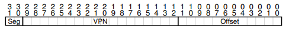
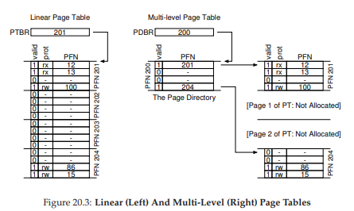

# 페이징: 더 작은 테이블

페이징의 두번째 문제점으로 페이지 테이블의 크기이다. 배열 형태를 가진 선형 페이지 테이블은 상당히 커질 수 있다. 이런 엄청난 메모리 부담을 줄 수 있는 상황을 해결하기 위한 기술을 아래에서 다룰 예정이다.

핵심 질문은 다음과 같다.

`페이지 테이블을 어떻게 더 작게 만들까?`

# 간단한 해법: 더 큰 페이지

페이지 테이블의 크기를 간단하게 줄일 수 있는 방법이 한 가지 있다. 페이지 크기를 증가시키면 된다. 페이지 크기가 4배 증가한다면 총 페이지의 갯수가 줄어들고, 그에 따라 페이지 테이블의 총 크기도 1/4배로 감소할 것이다.

하지만 페이지 크기의 증가는 부작용을 수반하는데, 페이지 내부의 낭비공간이 증가한다. 즉, **내부 단편화(internal fragmentation)** 이 발생한다. 결국 할당받은 페이지의 일부만 사용하기 때문에 메모리 고갈이 빨라지는 현상이 발생한다. 그래서 페이지 크기로 4KB 혹은 8KB를 채택하는 것이다.

# 하이브리드 접근 방법: 페이징과 세그멘트

Multics의 창시자 Jack Dennis는 페이징과 세그멘트의 장점을 결합하여 페이지 테이블 크기를 줄이는 아이디어를 내었다. 

힙과 스택에서 실제로 전체 공간 중 작은 부분만 사용되는 경우, 페이지 테이블이 대부분 비어있을 것이다. 

세그멘트와 페이징을 결합하는 방법으로, 프로세스의 전체 주소 공간을 위해 하나의 페이지 테이블을 두는 대신 논리 세그멘트마다 따로 페이지 테이블을 두는 것이다. 코드, 힙, 스택 세그멘트에 대해 페이지 테이블을 따로 두는 것이다.

세그멘테이션의 **베이스**, **바운드** 레지스터가 있다. 베이스 레지스터는 세그멘트의 시작 주소를 갖는 것이 아닌 세그멘트의 페이지 테이블의 시작 주소를 갖는다. 바운드는 페이지 테이블의 끝을 나타내기 위해 사용한다. 

소속 세그멘트를 나타내기 위해 상위 두 비트를 사용한다. 00은 미사용, 01은 코드, 10은 힙, 스택은 11을 나타낸다. 가상 주소는 다음과 같이 표현될 것이다.

하드웨어에 세 개의 베이스/바운드 레지스터 쌍이 코드, 힙, 스택을 위해서 존재한다고 가정한다. 프로세스들은 각 3개의 페이지 테이블을 갖는다. 

TLB 미스가 나면 하드웨어는 세그멘트 비트를 사용하여 어떤 베이스 바운드 쌍을 사용할 지 결정한다. 레지스터에 들어있는 주소로 가서 PTE주소를 얻고, VPN값을 변환하여 최종적으로 PFN을 찾는다.

하이브리드 기법의 핵심은 세그멘트마다 바운드 레지스터가 따로 존재한다는 것이다. 각 레지스터의 값은 최대 유효 페이지의 개수를 나타낸다. 예를 들어 첫 3개의 페이지들을 코드 세그멘트로 사용 중이면 코드 세그멘트 페이지 테입르은 세 개의 항복만 할당을 받을 수 있을 것이고 바운드 레지스터는 3으로 설정된다.

하지만 이 기법 역시 문제가 없는 것은 아닌데, 여전히 세그멘테이션을 사용하기 떄문에 빈 공간이 많은 힙의 경우에는 여전히 페이지 테이블의 낭비를 막을 수 없다. 

두번째로 외부 단편화를 유발한다. 하이브리드 방식에서는 페이지 테이블 크기에 제한이 없고 당양한 크기를 갖기 때문이다.

# 멀티 레벨 페이지 테이블

**멀티 레벨 페이지 테이블**은 사용하지 않는 주소 공간을 테이블에서 제거하는 기법이다. 이 기법은 기존의 선형 구조가 아닌 트리 구조로 표현한다.

페이지 테이블을 페이지 크기 단위로 나눈다. 만약 테이블의 페이지가 유효하지 않다면(비어있다면) 해당 페이지를 할당하지 않는다. **페이지 디렉터리(page directory)** 라는 자료 구조를 사용하여 각 페이지의 할당 여부를 파악한다.

위의 이미지에서 선형 테이블과 트리 테이블을 비교해보자. 좌측 그림은 중앙에 비어있는 공간이 많은 반면 우측은 유효한 테이블에만 공간이 할당되어 있다. 

페이지 디렉터리의 각 항목은 페이지 테이블의 한 페이지를 나타낸다. 페이지 디렉터리는 페이지 디렉터리 항목(page directory entries, PDE)로 구성된다. 이는 각 항목의 구성은  PTE와 유사하다. **유효(valid)** 비트와 **페이지 프레임 번호(page frame number, PFN)** 을 갖고 있다. PDE가 유효하다는 것은 그 항목이 가리키고 있는 페이지들 중 최소 하나가 유효하다는 뜻이다.

멀티 레벨 페이지 테이블에는 몇가지 장점이 있다.

첫째, 멀티 레벨 테이블은 사용된 주소 공간의 크기에 비례해 공간이 할당된다. 그렇기 때문에 보다 작은 페이지 테이블로 주소 공간을 표현할 수 있다.

둘째, 페이지 테이블을 페이지 크기로 문할하여 메모리 관리가 매우 용이하다. 페이지 테이블을 할당하거나 확장할 때, OS는 free 페이지 풀에 있는 빈 페이지를 가져다쓰면 된다.

선형 테이블을 메모리 공간에 할당할 때에는 연속된 물리 메모리 공간을 차지 하기 때문에 공간 할당이 쉽지 않지만, 멀티 레벨 테이블은 페이지 디렉터리를 이용해 흩어져 있더라도 찾을 수 있다. 따라서 메모리 공간 할당이 유연해진다.

다만 단점도 존재하는데, TLB 미스시 메모리 참조를 2번 이상 해야 하기 때문에 시간적 손해가 발생할 수 있다. 또한 복잡도가 증가하기도 한다.

# 역 페이지 테이블

더 획기적인 공간 절약 방법으로 **역 페이지 테이블(inverted page table)** 이 있다.
이 방법은 프로세스마다 페이지 테이블을 하나씩 가지는 게 아닌 시스템에서 하나의 페이지 테이블만 두는 것이다. 탐색 속도 향상ㅇ을 위해 주소 해시 테이블을 사용한다.
