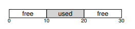
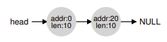
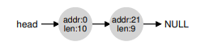
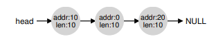
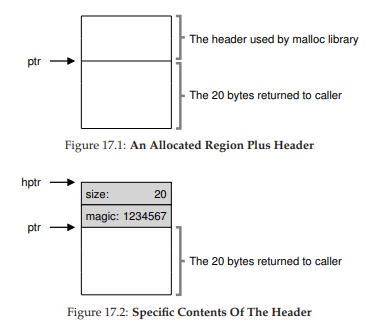
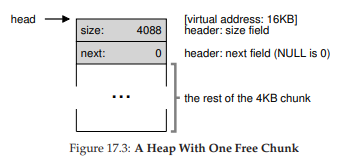
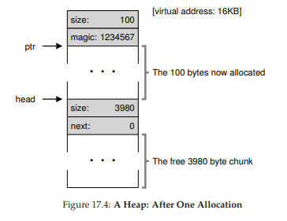
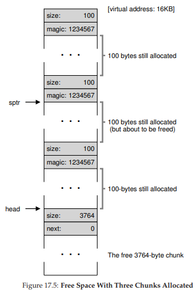
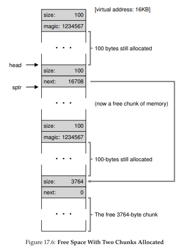
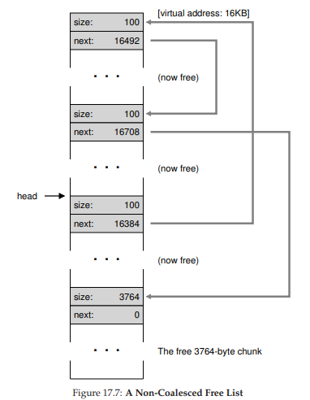

# 빈 공간 관리

추후에 **페이징**개념을 다룰 때 보겠지만 빈 공간 관리는 쉬울 수도 있다. 하지만 더 어렵고 흥미로운 경우는 가변 크기의 빈 공간들의 집합으로 구성된 경우다. 이 경우는 malloc()과 free()로 사용자 수준 메모리 할당 라이브러리나 **세그멘테이션**으로 물리 메모리를 관리하는 OS에서 발생한다. 어떤 경우에도 **외부 단편화**가 존재하게 된다. 빈 공간들의 전체 크기가 요청된 것보다 크더라도 하나의 연속된 영역이 존재하지 않으면 할당받지 못할 수 있다.



위의 그림이 그러하다. 전체 빈 공간은 20이지만 15 바이트를 요청할 경우 실패하게 될 것이다. 이 문제를 이 장에서 다룬다.

# 저수준 기법들

대부분의 할당기에서 사용되는 **분할(splitting)** 과 **병합(coalescing)** 의 기초에 대해 다룬다. 

## 분할과 병합

빈 공간 리스트는 힙에 있는 빈 공간들의 집합이다. 30바이트의 힙이 있다고 가정하자.


이 힙의 빈 공간 리스트에는 2개의 원소가 있는데, 처음의 0\~9 까지의 세그멘트와 20\~ 29까지의 세그멘트가 있다.



앞에서 언급하였듯이 10 바이트를 초과하는 모든 요청이 실패하여 NULL을 반환할 것이다. 그러나 10바이트 이하의 요청에 대해서는 할당이 이루어 질 것이다.

메모리를 1 바이트만 요청할 경우 이 할당기는 **분할(splitting)** 작업을 수행한다. 요청을 만족 시킬 수 있는 청크를 찾이 이를 둘로 분할한다. 첫번째 청크는 호출자에게 반환되고 나머지는 리스트에 남게 될 것이다. 그 결과는 아래의 이미지와 같다.



다시 처음의 예제로 돌아와서 분할과 동반되는 기법으로 **병합(coalescing)** 이 있다. 프로세스가 free(10)을 호출하여 힙의 중간의 공간을 반환할 경우 빈 공간 리스트에 추가가 될 것이다.



이 그림에는 문제가 하나 있는데, 만약 20바이트의 요청을 할 경우 빈 청크를 발견하지 못하고 실패한다는 것이다. 이 문제는 청크가 반환될 때 빈 공간들을 병합하여 해결할 수 있다. 반환할 때에는 빈 청크가 인접하여 있다면 하나의 큰 공간으로 병합하는 것이다. 최종적으로는 다음과 같아질 것이다.


## 할당된 공간의 크기 파악

free(void *ptr) 인터페이스는 크기를 매개변수로 받지 않는다. 대부분의 할당기가 추가 정보를 위해 **헤더(header)** 블럭에 저장하기 때문이다. 보통 해제된 청크 바로 직전에 위치하고 있다.



헤더는 적어도 할당된 공간의 크기는 저장하고 있고, 또한 해제 속도를 향상시키기 위해 추가 포인터, 부가적인 무결성 검사를 위한 매직 넘버 등의 정보를 저장할 수 있다.

헤더를 가리키는 포인터를 찾으면 라이브러리는 매직 넘버가 기대하는 값과 일치하는지 비교하여 **안정성 검사(sanity check)** 를 실시한다. 그리고 헤더의 크기와 해제된 영역을 합산하여 해제된 영역의 크기를 계산한다. 즉 빈 공간의 크기는 `해제된 영역 + 헤더의 크기`이고, 할당할 때 찾는 공간의 크기는 `요청된 영역 + 헤더의 크기`인 것이다.

## 빈 공간 리스트 내장

보통 새로운 노드를 위한 공간이 필요할 때 malloc()을 호출하지만, 빈 공간 리스트를 빈 공간에 구현하기 위해서는 불가능하다. 대신 직접 빈 공간 내에 구축해야한다.

4KB 크기의 힙이 있다고 가정하자. 이를 빈 공간 리스트로 관리하기 위해 리스트를 초기화 해야 한다. 리스트 노드의 설명은 다음과 같다.

```c
typedef struct __node_t {
    int size;
    struct __node_t *next;
}
```

힙을 초기화 하고 힙에 빈 공간 리스트의 첫 번째 원소를 넣는 코드를 살펴보자. 시스템 콜 mmap을 호출하여 얻어진 영역에 구축된다고 가정한다. 코드는 다음과 같다.

```c
node_t *head = mmap(NULL, 4096, PROT_READ|PROT_WRITE, MAP_ANON|MAP_PRIVATE, -1, 0);
head->size = 4096 - sizeof(node_t);
head->next = NULL;
```

이 코드의 실행 후 리스트는 다음과 같이 크기 4088의 항목 하나만을 가지게 된다. 



자 이제 100바이트의 메모리 청크가 요청되었다고 가정하자. 이 요청을 처리하기 위해 라이브러리는 충분한 크기의 청크를 찾는다. 하나의 청크만이 존재하기 때문에 이 청크가 선택될 것이다. 앞서 설명하였듯이 `요청된 크기 + 헤더의 크기`를 충족시키는 청크과 나머지 빈 청크 두개로 **분할**된다. 헤더의 크기를 8바이트라고 가정하면 힙의 공간은 다음과 같아질 것이다.



100바이트의 요청이 오면 108바이트를 할당하고 할당 영역을 가리키는 ptr을 반환한다. 그리고 free()에서 사용할 수 있도록 할당된 공간 직전에 헤더 정보를 넣는다. 그리고 나머지 빈 노드를 3980으로 축소한다.

이제 100바이트씩(헤더 포함 108바이트) 할당된 3개의 공간이 존재하는 힙을 살펴보자. 힙의 모습은 다음과 같다.



3개의 헤더와 호출 프로그램에 의해 사용 중인 3개의 100바이트 영역을 볼 수 있다. 빈 공간 리스트는 여전히 head가 가리키는 하나의 노드로 구성되어 있지만 3번의 분할 이후 3764바이트로 축소된 모습이다.

이 상황에서 free(16500)를 통해 (`메모리 영역 시작 주소 16384 + 이전 영역 108 + 헤더 8 = 16500`) sptr이 가리키고 있는 공간을 해제한다면 어떻게 될까?

라이브러리는 빈 공간의 크기를 파악하고 빈 청크를 빈 공간 리스트에 넣는다. 그리고 빈 공간 리스트의 헤드 쪽에 삽입하여 다음의 그림처럼 될 것이다.



리스트가 2개 이상의 원소를 가지게 되는 것과 동시에 흔히 일어나는 단편화가 발생하였다.

마지막으로 마지막 2개의 사용 중인 청크를 해제하여보자. 해제하더라도 병합되지 않는다면 단편화 된 채로 남아있을 것이다.



이 문제의 원인은 리스트를 **병합**하지 않았기 때문이다. 메모리는 모두 비어있지만 작은 조각들로 구성되어 있기 때문이다. 해결책은 간단한데, 리스트를 순휘하면서 인접한 청크를 **병합**하면 된다. 완료되면 힙은 하나의 큰 청크가 될 것이다.

## 힙의 확장

마지막 주제로 힙 공간이 부족한 경우 어떻게 할 것인가? 가장 간단한 방법으로는 실패, NULL을 반환하는 방법이 있다. 어떤 경우에는 이것이 유일한 대안이 될 것이다.

대부분 전통의 할당기는 적은 크기의 힙으로 시작하여 모두 소진하면 OS에 더 많은 메모리를 요청한다. 할당기는 힙을 확장하기 위해 특정 시스템 콜을 호출한다. 그런 후 확장된 영역에서 청크를 할당한다.

# 기본 전략

일부 기법은 간략히 살펴보았으므로 빈 공간 할당을 위한 기본 전략을 살펴보자. 

## 최적 적합(Best Fit)

**최적 적합** 전략은 간단하다. 먼저 빈 공간 리스트를 검색하여 요청한 크기와 같거나 다 큰 빈 메모리 청크를 찾는다. 그 후 후보자 그룹중에서 가장 작은 크기의 청크를 반환한다. 이 청크는 **최적 청크**라고 불린다. 최소 적합이라고도 불릴 수 있다. 

최적 적합의 배경은 간단한데 사용자가 요청한 크기에 가까운 블럭을 반환함으로써 최적 적합은 공간의 낭비를 줄이려고 노력한다. 그러나 이에는 비용이 수반되는데 항상 리스트 전체를 탐색해야 하기 때문에 엄청난 성능 저하가 야기된다.

## 최악 적합(Worst Fit)

**최악 적합**은 최적 적합의 반대 방식이다. 가장 큰 빈 청크를 찾아 요청된 크기만큼만 반환하고 남는 부분은 빈 공간 리스트에 계속 유지한다. 최악 적합의 목적은 최적 적합에서 발생될 수 있는 작은 청크를 방지하는 것이다. 그러나 이 또한 빈 공간 리스트 전체를 탐색해야하는 오버헤드가 존재한다.

## 최초 적합(First Fit)

**최초 적합**은 간단하게 요청보다 큰 첫 번째 블럭을 찾아 요청만큼 반환한다. 최초 적합은 빠르다는 것이 장점이다. 그러나 리스트의 시작에 크기가 작은 객체가 많이 생길 수 있다. 따라서 리스트의 순서를 관리하는 방법이 쟁점이다. 한 가지 방법으로 **주소-기반 정렬(address-based ordering)** 을 사용하는 것이다.

## 다음 적합(Next Fit)

항상 리스트의 처음부터 탐색하지 않고 **다음 적합**은 마지막으로 찾은 청크의 포인터를 유지한다. 최초 적합과 비슷하지만 시작점을 이전 지점부터 이어서 하기 때문에 작은 청크가 더 균등하게 분산될 것이다.

# 다른 접근법

## 개별 리스트

한 동안 유행했던 방법으로 **개별 리스트(segregated list)** 를 사용하는 것이다. 특정 응용 프로그램이 자주 요청하는 크기가 있다면 그 크기의 객체를 관리하기 위한 별도의 리스트를 유지하는 것이다.

이 방법의 장점은 분명하다. 특정 크기의 요청을 위한 메모리 청크를 유지함으로써 단편화의 가능성을 상당히 줄일 수 있다. 복잡한 리스트 검색이 필요하지 않아 할당과 해제 요청을 신속히 처리한다.

이 방법은 시스템에 새로운 문제를 야기하기도 한다. 지정된 크기의 메모리 풀과 일반적인 풀에 얼마만큼의 메모리를 할당할 것인가? 특수 목적 할당기인 **슬랩 할당기(slab allocator)** 는 이 문제를 더 나은 방법으로 해결한다.

버컬이 부팅할 때 커널 객체를 위한 여러 **객체 캐시(object cache)** 를 할당한다. 커널 객체는 락, FS inode 등 자주 사용되는 자료 구졷르을 일컫는다. 아이노드들로 구성된 객체 캐시도 있고 락 구조만을 담은 객체 캐시도 있다. 기존에 할당된 캐시 공간이 부족하면 추가 **슬랩**을 요청한다.

슬랩 할당은 빈 객체를 초기화된 상태로 유지한다는 점에서 개별 리스트보다 우수하다. 반납된 객체를 초기화 된 상태로 유지하여 잦은 초기화와 반납 작업을 피할 수 있어 오버헤드를 감소 시켰다.

## 버디 할당

빈 공간의 합병은 할당기의 매우 중요한 기능이다. 이 합병을 간단히 한 좋은 예시로 이진 **버디 할당기(binary buddy allocator)** 가 있다. 빈 메모리는 2^N의 크기로 생각된다. 메모리 요청이 발생하면 요청한 크기와 같아질 때 까지 2개로 계속 분할한다. 마지막에 더이상 분할할 수 없을 때 이 청크를 반환한다. 

다만 이 방식은 2의 거듭제곱 크기만큼의 블럭만 할당할 수 있기 때문에 **내부 단편화** 문제가 있다.

이 버디 할당의 아름다운 점은 블럭이 해제될 때 있다. 이 블럭이 해제되면 같은 크기의 "버디"가 비어있는지 확인하고 비어있다면 병합한다. 병합된 블럭의 "버디"가 또 비어있다면 재귀적으로 병합하게 된다.

버디 할당이 잘 작동하는 이유는 특정 블럭의 버디를 결정할 때 각 버디 쌍의 주소는 한 비트만 다르기 때문에 결정하기 쉽다.
