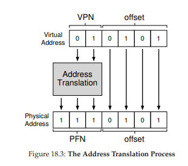
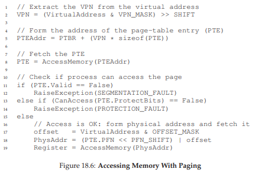

# 페이징

OS는 공간 관리 문제를 해결할 때 두가지 중 하나를 사용한다. 하나는 **세그멘테이션**으로, 가변 크기의 조각으로 분할하여 관리하는 것이다. 다만 분할할 때 **단편화(fragmented)** 될 수 있고 할당이 점점 어려워지게 된다.

두번쨰 방법으로 **페이징(paging)** 이 있다. 동일 크기의 조각으로 분할하는 것이다. 프로세스를 고정 크기의 단위로 나누고 이 고정 크기 단위를 **페이지(page)** 라고 부른다. 물리 메모리도 **페이지 프레임(page frame)** 이라고 불리는 배열이라고 생각한다.

# 개요

앞으로 보겠지만 페이징은 이전 방식에 비해 많은 장점이 있다. 아마도 가장 중요한 개선은 **유연성**일 것이다. 페이징을 사용하면 주소 공간이 어떤 방식으로 사용되는지 상관하지 않고 효율적으로 주소 공간 개념을 지원할 수 있다.

또 다른 장점으로 단순함이다. OS가 주소 공간의 배치를 원한다고 하면 빈 공간 리스트에서 필요한 만큼의 페이지만 찾으면 된다. 

주소 공간읕이 각 가상 페이지에 대한 물리 메모리 위치를 기록하기 위해 OS는 프로세스마다 **페이지 테이블(page table)** 이라는 자료 구조를 유지한다. 이 페이지 테이블의 주요 역할은 가상 페이지 **주소 변환(address translation)** 정보를 저장하는 것이다.

프로세스가 가상 주소 변환을 위해 **가상 페이지 번호(virtual page number)** 와 페이지 내의 오프셋 2개의 구성 요소로 분할한다. 최상위 N개의 비트가 VPN이고, 이는 변환되어 **물리 프레임 번호(physical frame number, PFN)** 혹은 **물리 페이지 번호(physical page number, PPN)** 이 된다. 그리고 나머지 비트는 오프셋이 된다.



# 페이지 테이블은 어디에 저장되는가

페이지 테이블은 매우 커질 수 있다. 이전에 다뤘던 세그멘트 테이블이나 베이스-바운드 쌍에 비해서 말이다.

20 비트 VPN은 각 프로세스를 위해 관리해야 하는 변환의 갯수가 2^20 이라는 것을 의미한다. 물리 주소로의 변환 정보와 다른 필요한 정보를 저장하기 위해 **페이지 테이블 항목(page table entry, PTE)** 마다 4MB가 필요하다. 이는 엄청 큰 크기인데, 프로세스 100개가 실행중이면 400MB를 사용하는 것이다.

페이지 테이블이 매우 크기 때문에 이를 MMU 안에 유지하지 않을 것이다. 대신 각 프로세스의 메모리에 저장한다. 

# 페이지 테이블에는 실제 무엇이 있는가

페이지 테이블은 가상 주소를 물리 주소로 매핑하는데 사용되는 자료 구조를 가지고 있다. 가장 간단한 형태로는 **선형 페이지 테이블(linear page table)** 이다. 단순한 배열이다. 

각 PTE에는 심도있는 이해가 필요한 비트들이 존재한다. **Valid Bit**는 특정 변환의 유효 여부를 나타내기 위해 포함된다. 예를 들어 코드나 힙이 주소 공간의 한쪽에 있고 반대 쪽은 스택이 차지하고 있을 것이다. 그 사이 모든 미사용 공간은 **무효(invalid)** 로 표시되고, 이에 접근시 OS에 트랩을 발생시킨다.

페이지가 읽을 수 있는지 쓸 수 있는지, 또는 실행될 수 있는지를 표시하는 **protection bit**가 있다. 이 비트가 허용하지 않는 접근을 할 경우 트랩을 발생 시킨다.

중요하지만 지금은 다루지 않는 비트들도 있다. Present bit는 이 페이지가 물리 메모리에 있는지 디스크에 있는지(**스왑 아웃** 되었는지) 가리킨다. **reference bit**(또는 **accessed bit**)는 페이지가 접근 되었는지 추적하기 위해 사용된다. 또한 어떤 페이지가 인기 있는지 결정하여 메모리에 유지할 지를 결정한다.

# 페이징: 너무 느림

페이지 테이블의 크기가 메모리 상에서 매우 크게 증가할 수 있고, 그로 인해 처리 속도가 저하될 수 있다. 간단한 명령어로 예를 들어보자.

`mov1 21, %eax`

주소 21에 대한 참조만 고려해보자. 하드웨어가 주소 **변환**을 담당하게 될 것이다. 시스템은 가상 주소(21)를 물리 주소(117)로 변환해야 한다. 변환하기 위해서 현재 실행 중인 프로세스의 페이지 테이블 위치를 알아야 한다. **페이지 테이블 베이스 레지스터(page table base register)** 에 시작 주소를 저장한다고 가정한다. 원하는 PTE의 위치를 찾기 위해 다음과 같은 연산을 수행한다.

```c
VPN = (VirtualAddress & VPN_MASK) >> SHIFT
PTEAddr = PageTableBaseRegister + (VPN * sizeof(PTE))
```

여기서 VPN_MASK는 110000 으로 설정되고 VPN 비트만 골라낼 것이다. SHIFT는 오프셋 길이인 4만큼 설정된다. 가상 주소 21이 위의 과정을 거치면 01 혹은 가상 페이지 1로 변환된다.

또한 오프셋을 구하고 물리 주소를 얻을 때 다음과 같은 연산을 수행한다.

```c
offset = VirtualAddress & OFFSET_MASK
PhysAddr = (PFN << SHIFT) | offset
```

마지막으로 하드웨어는 메모리에서 원하는 데이터를 가져와서 eax 레지스터에 넣을 수 있다.
정리를 위해 아래에 있는 메모리 참조시 세부 동작을 살펴보자. 모든 메모리 참조에 대해 페이지 테이블에서 변환 정보를 반입해야 하기 때문에 반드시 한번의 추가적인 메모리 참조가 필요하다. 이 경우 프로세스는 2배 이상 느려진다.


