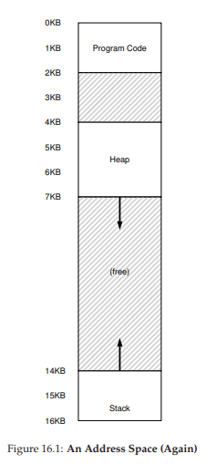
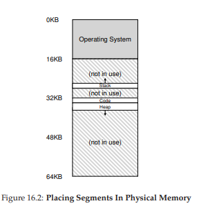
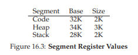

# 세그멘테이션

베이스와 바운드 방식을 해결할 방법으로 **세그멘테이션(segmentation)** 이 등장하였다.

아이디어는 간단한데, MMU에 하나의 베이스와 바운드값이 존재하는 것이 아니라 **세그멘트(segment)** 마다 베이스와 바운드 값이 존재한다. 우리가 기존에 사용하던 주소 공간에는 코드, 스택, 힙 세 종류의 세그먼트가 있는 것이다. 세그멘테이션을 사용하면 OS는 각 세그먼트를 물리 메모리의 각기 다른 위치에 배치할 수 있고, 사용되지 않는 가상 주소 공간을 줄일 수 있다.

16.1 예제로 주소 변환을 해보자. 가상 주소 100번지를 참조한다고 가정하자. 16.1 에서 볼 수 있듯이 가상 주소 100번지는 코드 세그멘트에 속한다. 참조가 일어나면 하드웨어는 베이스 값(16.3 참조)에 이 세그멘트의 오프셋(여기서는 100)을 더해 물리 주소는 32KB + 100 또는 32868이 된다.

가상 주소 4200의 힙을 살펴보자. 가상 주소 4200을 힙의 베이스(34KB)에 더하면 39016을 얻지만 이는 올바른 물리 주소가 아니다. 이는 16.1 이미지에서 보듯이 힙이 가상 주소 4KB(4096)부터 시작하기 때문인데, 오프셋 4200이 실제로는 4200 - 4096, 즉 104인 것이다. 이 오프셋을 베이스에 더해 원하는 결과 34920을 얻게 된다.

만약 힙의 마지막을 벗어난 (가상 주소로부터 7KB 이상 먼) 주소를 접근하려고 하면 하드웨어가 이를 감지하고 OS에 트랩을 발생시킨다. 이를 **세그멘트 폴트(segment fault)** 라고 한다.

# 세그멘트 종류의 파악

하드웨어는 변환을 위해 세그멘트 레지스터를 사용한다. 하드웨어는 가상 주소가 어느 세그멘트를 참조하고 오프셋은 얼마인지를 어떻게 알 수 있을까?

일반적인 접근법으로는 가상 주소의 최상위 2비트를 세그멘트 종류를 구분하는 데 사용하는 것이다. 00이면 코드, 01이면 힙, 11이면 스택 세그멘트임을 나타낸다.

위의 가상 주소 4200을 비트로 변환하면

`01 0000 0110 1000`

으로 나타낼 수 있다.

앞의 두자리는 힙을 나타내는 01, 뒤의 12자리는 오프셋을 나타내는 104이다. 

다만 상위 2 비트를 사용해 세그멘트를 선택하는 것이 가상 주소 공간의 활용도를 제한하기도 한다. 세그먼트를 구분하기 위해 2비트를 써서 각각 코드, 힙, 스택이 00, 01, 11을 사용하지만 남은 10 만큼(즉 1 / 4)의 공간을 손해 보는 것이다. 또한 만ㅇ약 힙이나 스택이 4KB이상 커지기를 원하면 그때는 방도가 없다.

# 스택

중요한 구성 요소 중 하나인 스택을 다루지 않았다. 앞의 16.2 그림에서 물리 주소 28KB에 위치하지만, 다른 중요한 차이가 하나 있다. 스택은 다른 세그멘트와 달리 *반대 방향*으로 확장한다는 것이다. 이를 위해 다른 방식의 변환이 필요하다.

간단한 하드웨어가 추가로 필요하다. 베이스와 바운드 값뿐 아니라 세그멘트가 어느 방향으로 확장하는지도 알아야 한다. 이를 세그멘트 레지스터에 기록한다.

16.1의 이미지에서 예를 들어 15KB에 접근한다고 가정하자. 가상 주소를 이진 형태로 바꾸면 `11 1100 0000 0000` 이 된다. 앞의 11은 세그멘트, 뒤의 12비트를 계산하면 3KB의 오프셋이 나온다. 스택은 거꾸로 확장하므로 음수 오프셋이 필요한데, 오프셋 3KB에서 세그멘트의 크기인 4KB를 뺴서 나온 -1KB가 음수 오프셋이 된다. 이를 베이스 28KB에서 오프셋 -1KB을 적용하면 물리 주소인 27KB가 된다. 만약 음수 오프셋의 절대값이 세그멘트의 현재 크기보다 크다면 세그멘트 폴트가 나올 것이다.

# 공유 지원

세그멘테이션 기법이 발전함에 따라 간단한 하드웨어 지원을 추가함으로써 다른 종류의 효율성을 찾아내었다. 바로 메모리를 절약하기 위해 **코드 세그멘트를 공유**하는 것이다. 공유를 지원하기 위해 하드웨어에 **protection bit**의 추가가 필요하다. 

protection bit를 추가하여 세그멘트를 읽거나 쓰거나 실행시킬 수 있는지를 나타낸다. 코드 세그멘트를 읽기 전용으로 설정하여 독립성을 유지하면서도 여러 프로세스가 주소 공간의 일부를 공유할 수 있다. 동시에 각 프로세스는 여전히 자신들만의 전용 메모리를 쓰고 있다는 환상을 유지할 수 있다.

# 운영체제의 지원

세그멘테이션의 도입을 위해서는 OS가 해결해야할 문제가 몇가지 있다. 

문맥 교환시 OS는 세그멘트 레지스터의 저장과 복원을 해야한다. 각 프로세스는 가상 주소 공간을 가지고 있기 때문에 OS는 프로세스 실행시 레지스터들을 올바르게 설정해야 한다.

세그멘트 크기의 변경도 다룰 수 있어야 한다. 어떤 프로세스가 malloc()을 호출하였을 때 빈 공간을 할당하여 호출자에게 포인터를 돌려줄 것이다. 하지만 남은 공간이 없다면 세그멘트 크기를 증가시켜야 한다. 만약 시스템에 존재하는 메모리가 고갈되었거나 이미 많은 메모리를 사용 중이라면 이를 거절할 수도 있다.

마지막으로 미사용 물리 메모리 공간의 관리이다. 새로운 공간이 생성되면 OS는 세그멘트를 위해 비어있는 물리 메모리 영역을 찾을 수 있어야 한다. 하지만 세그멘트의 크기는 각자 달라서 작은 크기의 빈 공간들이 자주 생기게 된다. 이러한 작은 공간들은 세그멘트에 할당할 수도 없고, 확장에도 별 도움이 되지 않는다. 이 문제를 **외부 단편화(external fragmentation)** 이라고 부른다.

이 문제의 해결책 중 하나로 세그멘트를 정리하여 **압축**하는 방법이 있다. 현재 실행중인 프로세스를 중단하고 그들의 데이터를 연속된 공간에 복사하여 새로운 큰 빈 공간을 확보할 수 있다. 하지만 세그멘트의 복사는 메모리에 부하도 크고 프로세서 시간을 상당히 많이 사용하기 때문에 비용이 크다. 

간단한 방법으로는 빈 공간 리스트를 관리하는 알고리즘을 사용할 수도 있다. 빈 공간 관리 알고리즘은 할당 가능한 메모리 영역을 리스트의 형태로 유지하는 것이다. **최적 적합(best-fit), 최악 적합(worst-fit), 최초 적합(first-fit), 버디 알고리즘(buddy algorithm)** 과 같은 알고리즘 등 수많은 방법이 존재한다. 이 중 최적 적합이 빈 공간 리스트에서 요청된 크기와 가장 비슷한 크기의 공간을 할당한다.

알고리즘이 아무리 정교하게 동작하더라도 외부 단편화는 여전히 존재한다. 좋은 알고리즘은 외부 단편화를 줄이는데에 목표를 두고있을 뿐이다.
