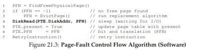

# 물리 메모리 크기의 극복: 매커니즘

그동안은 실행중인 프로세스의 *전체* 주소 공간이 탑재된 것으로 가정하고 있었다. 하지만 실제로는 다수의 프로세스들이 각자 큰 주소 공간을 사용하고 있는 것이다. 

이를 위해 **메모리 계층**에 레이어 추가가 필요하다. 지금까지는 모든 페이지들이 물리 메모리에 존재하였지만, OS는 현재 크게 필요하지 않은 일부를 보관해 둘 공간이 필요하다. 일반적으로 더 크고 더 느리다. 현대 시스템에서는 주로 **HDD**가 이 역할을 담당한다.

# 스왑 공간

가장 먼저 할 일은 디스크에 페이지들을 저장할 공간을 확보하는 것이다. 이 용도의 공간을 **스왑 공간(swap space)** 이라고 한다. 스왑 공간인 이유는 메모리에서 디스크로 쓰고(swap out) 여기서 페이지를 읽어 메모리에 탑재(swap in) 하기 때문이다.

하지만 스왑 공간에만 스왑을 할 수 있는 것은 아니다. 프로그램을 실행 하고자 할 때 프로그램의 페이지들은 디스크에 존재한다. 실행하면 각 페이지들이 메모리에 탑재된다. 이 때 물리 메모리에 추가 공간을 확보해야 할 경우 코드 영역의 페이지들이 차지하는 영역은 즉시 다른 페이지가 사용할 수 있다. 코드가 저장되어 있는 파일 시스템 영역이 스왑 목적으로 사용가능하기 때문이다. 이러한 페이지들은 디스크에 원본이 있으므로 언제든지 다시 스왑 인이 가능하기 때문이다.

# Present bit

메모리가 참조되는 과정을 다시 살펴보자. 가상 주소에서 VPN을 추출하여 TLB를 검사한다. TLB 히트가 되든, 미스가 되어 페이지 테이블을 참조하여 다시 TLB 히트가 되도록 할 것이다.

디스크가 스왑 가능해 지기 위해서는 PTE에서 해당 페이지가 물리 메모리에 존재하지 않는다는 것을 표현해야 한다. **present bit**를 사용해 1이면 물리 메모리에 존재하는 것이고 0이라면 메모리에 존재하지 않고 디스크 어딘가에 존재한다는 것을 나타낸다. 이 존재하지 않는 페이지를 접근 하는 것을 **페이지 폴트(page fault)** 라고 한다.

페이지 폴트가 발생하면 **페이지 폴트 핸들러(page-fault handler)** 가 실행된다.

# 페이지 폴트

만약 요청된 페이지가 메모리에 없고 디스크로 스왑되었다면 OS는 해당 페이지를 메모리로 스왑 해온다. OS는 PFN과 같은 PTE 비트들을 페이지의 디스크 주소를 나타내는 데 사용하여 페이지 폴트 발생 시 디스크 상의 위치를 파악하여 메모리로 탑재한다.

디스크 I/O가 완료되면 PTE의 PFN 값을 탑재된 메모리 값으로 갱신한다. 또한 TLB의 갱신도 같이 처리하여 미스를 막을 수 있다.

I/O 전송 중에는 해당 프로세스가 **차단된(blocked)** 상태가 되는 것을 유의해야 한다. 이 때 다른 프로세스가 **중첩(overlap)** 되어 실행 시킬 것이다. 이는 멀티 프로그램된 시스템에서 하드웨어를 최대한 사용하는 방법 중 하나이다.

# 메모리에 빈 공간이 없다면?

위 설명에서 스왑 인 하기 위한 메모리가 충분하다고 가정했다. 하지만 메모리의 여유 공간이 없을 수 있다. 새로운 페이지를 위해 기존의 하나 또는 그 이상의 페이지들을 먼저 **페이지 아웃(page out)** 해야할 수 있다. **교체(replace)** 페이지를 선택하는 것을 **페이지 교체 정책(page-replacement policy)** 라고 한다.

잘못된 정책은 성능에 심각한 영향을 끼칠 수 있다. 디스크와 메모리는 10,000배 또는 100,000배 정도의 차이가 나기 때문에 메모리가 디스크와 같은 속도로 동작하는 일이 없 도록 정책에 있어서 신중해야 한다.

# 페이지 폴트의 처리

페이지 폴트의 처리는 위의 이미지와 같이 처리된다.
1. 비어있는 페이지를 찾는다.
2. 없을 경우 페이지 교체 알고리즘을 실행한다.
3. 교체가 완료되면 PTE에 새로 할당된 페이지의 정보를 갱신한다.
4. 명령어를 재시도 한다.

# 교체는 실제 언제 일어나는가

위의 설명에서는 메모리에 여유 공간이 고갈된 후 교체 알고리즘을 실행하였지만, 이는 효율적이지 않다. 그래서 OS는 항상 어느정도의 여유 공간을 확보하게 된다.

OS는 여유 공간에 대한 **최댓값(high watermark, HW)** 과 **최솟값(low watermark, LW)** 을 설정하여 교체 알고리즘을 작동시킨다. 이는 주로 **스왑 데몬(swap daemon)** 혹은 **페이지 데몬(page daemon)** 이라 불리는 백그라운드 쓰레드에 의해 실행된다.

후에 다루겠지만 다수의 페이지들을 **클러스터(cluster)** 나 **그룹(group)** 으로 묶어서 한번에 스왑 파티션에 저장하여 디스크의 효율을 높인다. 이를 한번에 교체할 경우 성능 개선에 도움이 된다.
