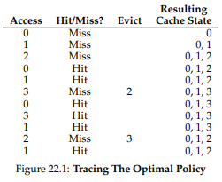
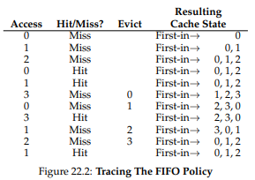
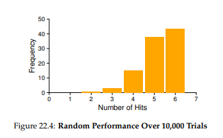
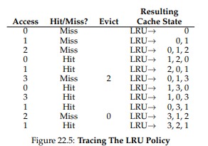

# 물리 메모리 크기의 극복: 정책

메모리에 여유 공간이 많을 수록 관리하기 쉽지만 메모리의 공간이 거의 없다면 일이 복잡해진다. OS는 **메모리 압박(memory pressure)** 을 해소하기 위해 다른 페이지들을 강제로 페이징 아웃 하여 공간을 확보한다. **내보낼(evict)** 페이지들의 선택은 OS의 **교체 정책(replacement policy)** 에 의해 결정된다.

# 캐시 관리

페이지들의 일부만이 메인 메모리에 유지된다는 것을 가정하면 메인 메모리는 시스템의 가상 메모리를 위한 캐시로 생각할 수 있다. 이 캐시를 위한 교체 정책의 목표는 **캐시 미스**의 횟수를 최소화 하고 **캐시 히트** 횟수를 최대화 하는 것이다.

캐시 히드와 미스의 횟수를 안다면 프로그램의 **평균 메모리 접근 시간(average memory access time, AMAT)** 을 계산할 수 있다.

`AMAT = 메모리 접근 비용 + (캐시 미스율 * 디스크 접근 비용)`

AMAT을 계싼하기 위해서는 메모리 접근 비용과 디스크 접근 비용을 알아야 한다. 캐시 미스율이 0.1, 메모리 접근 비용을 100ns, 디스크 접근 비용이 10ms 라고 가정할 때 AMAT은 100ns + 0.1 * 10ms = 1.0001ms, 약 1ms가 된다. 만약 미스율이 0.001퍼가 되었다면 결과는 확연히 달라질 것이다. 

여기서 볼 수 있듯 디스크 접근 비용이 너무 크기 때문에 아주 작은 미스가 발생하더라도 전체적인 AMAT 에 큰 영향을 줄 수 있다.

# 최적 교체 정책

교체 정책의 동작 방식을 이해하기 위해 **최적 교체 정책(The Optimal Replacement Policy)** 와 비교하는 것이 좋다.

최적 기법은 가장 나중에 접근될 페이지를 교체하는 것이 최적이며 가장 적은 횟수의 미스를 발생시킨다는 것을 증명하였다.

그림은 최적의 기법의 동작을 보여준다. 캐시는 처음 세번의 접근은 당연히 미스이다. 이러한 미스를 **최초 시작 미스(cold-start miss)** 또는 **강제 미스(compulsory miss)** 라고 한다.

이 예제의 히트율을 계산해보면 `6 / 11 = 54.5%`가 된다. 강제 미스들을 제외한다면 85.7%가 된다. 

그렇지만 스케줄링때도 그랬듯이 일반적으로 미래에 일을 미리 알 수 없다. 그래서 범용 OS에서는 최적 기법의 구현이 불가능 하다. 최적 기법은 비교 기준으로만 사용될 것이며 얼마나 "정답"에 가까운지 알 수 있다.

# 간단한 정책: FIFO

첫째로 매우 간단한 방법이다. 일부 시스템에서는 **FIFO**를 채택하였다.

FIFO는 구현하기 매우 쉽지만 최적의 경우와 비교하면 눈에 띄게 성능이 좋지 않은 것을 볼 수 있다. 히트율이 무려 **36.4%** 다. FIFO는 페이지들의 중요도를 파악할 수 없다.

# 또 다른 간단한 정책 무작위 선택

이 역시 구현하기는 매우 쉽지만 선택할 때 얼마나 운이 좋은지에 전적으로 의존한다. 무작위 선택 방식의 동작은 그떄끄떄에 따라 달라질 것이다.

# 과거 정보의 사용: LRU

페이지 교체 정책이 활용할 수 있는 과거 정보 중 하나는 **빈도수(frequency)** 이다. 한 페이지가 여러 차례 접근 되었다면, 분명 가치가 있기 떄문에 교체되면 안될 것이다. 좀 더 자주 사용되는 페이지의 특징은 접근의 **최근성(recency)** 이다. 최근에 접근된 페이지일수록 가까운 미래에 접근될 확률이 높을 것이다.

이러한 정책은 **지역성의 원칙(principle of locality)** 라고 부르는 특성에 기반을 둔다. 이 원칙이 말하는 것은 단순한다. 프로그램들은 특정 코드와 자료구조를 상당히 자주 접근하는 경향이 있다는 것이다.

그래서 이 알고리즘들이 탄생하게 되었다. **Least-Frequently-Used(LFU)** 정책은 가장 적은 빈도로 사용된 페이지를 교체한다. **Least-Recently-Used(LRU)** 정책은 가장 오래 전에 사용하였던 페이지를 교체한다.

위 그림은 LRU가 최적 기법과 동일한 수준의 성능을 얻을 수 있는 최고의 결과를 보여준다.

# 과거 이력 기반 알고리즘의 구현

LRU의 구현을 어떻게 할 것인가? 이를 완벽하게 구현하기 위해서는 많은 작업이 필요하다.

각 페이지마다 해당 페이지가 가장 앞으로(MRU 측으로) 이동하도록 자료 구조를 갱신해야 한다. LRU는 어떤 페이지가 가장 최근에 사용되었는지를 관리하기 위해서 모든 메모리 참조 정보를 기록해야 한다. 이는 성능을 크게 저하 시킬 수 있다.

이를 좀 더 효율적으로 하려면 하드웨어의 지원을 받을 수 있다. 페이지의 접근이 있을 때 마다 메모리의 시간 필드를 갱신하도록 하는 것이다. 하지만 페이지 수가 증가하면 시간 정보 배열을 검색하는 것은 매우 고비용의 연산이 된다. 현대의 CPU 속도라 할 지라도 백만개 이상의 페이지를 검색하는 것은 굉장이 오래 걸릴 것이다.

대신 가장 오래된 페이지가 아니더라도 비슷하게 오래된 페이지를 찾는 방법을 택하게 된다.

# LRU 정책 근사하기

LRU를 "근사"하는 방식으로 만들게되면 구현이 훨씬 쉬워진다. 이 개념에는 **use bit**(혹은 **reference bit**)라고 하는 하드웨어의 지원이 필요하다. 페이지마다 하나의 use bit가 있으며(페이지 테이블에 존재하거나 별도의 배열에 있을 수 있다.) 페이지가 참조될 때 마다 use bit가 1로 설정된다. 하드웨어는 0으로 절대 바꾸지 않고 OS가 할 것이다.

OS는 **시계 알고리즘(clock algorithm)** 을 사용하여 use bit를 활용한다.

시스템의 모든 페이지 들을 환형리스트로 구성하고 **시계 바늘(clock hand)** 이 특정 페이지를 가리킨다고 해보자.

- 만약 use bit가 1이면 최근에 사용되었다는 뜻이므로 0으로 바꾸고 지나간다.
- 만약 use bit가 0이면 최근에 사용되지 않았으므로 교체 대상으로 지정한다.

이 과정을 교체 대상을 찾을 때 까지 반복한다. 

혹은 이 방식을 변형하여 시계 바늘이 랜덤한 페이지를 검사하게 할 수도 있다. 완벽한 LRU 만큼의 성능을 보이지는 않아도 과거 정보를 고려하지 않는 다른 기법에 비하면 성능이 좋다.

# 갱신된 페이지(Dirty Page)의 고려

만약 어떤 페이지가 **변경(modified)** 되어 **더티(dirty)** 상태가 되었다면 그 페이지를 내보낼 때 디스크에 기록해야 하므로 비용이 비싸진다.

반면 clean한 상태인 페이지들은 추가 I/O 없이 다른 용도로 다시 쓰일 수 있다. 그래서 더티 페이지 대신 깨끗한 페이지를 내보내는 것을 선호한다.

이 동작을 지원하기 위해 하드웨어는 **modified bit(dirty bit)** 를 포함해야 한다. 이 비트가 1로 설정되면 페이지 교체 알고리즘에서 이를 참고하여 교체 대상을 선택한다.

# 다른 VM 정책들

VM이 채택한 정책은 페이지 교체 정책 외에도 더 있다.

OS가 페이지를 언제 메모리로 불러 들일지 선택하는 페이지 선택(page selection) 정책도 있다.

또한 **요구 페이징(demand paging)** 정책도 있다. 이는 "요청된 후 즉시"  해당 페이지를 메모리로 읽어 들인다. 이는 어떤 페이지가 곧 사용될 것이라는 것을 알 수 있기 때문이다.

또 다른 정책 중 하나로 디스크에 반영할 때 사용하는 방식이다. 기록해야할 페이지들을 한번에 메모리에 모은 후 한번에 (더 효율적으로) 디스크에 기록한다. 이러한 동작을 **클러스터링(clustering)** 또는 쓰기 **모으기**(**grouping** of writes)라고 부른다.

# 쓰래싱(Thrashing)

메모리 사용 요구가 감동할 수 없을 만큼 많고 실행 중인 프로세스가 요구하는 메모리가 가용 크기를 초과하는 경우에 시스템은 끊임없이 페이징 하게 된다. 이를 **쓰래싱(thrashing)** 이라고 한다.

초기 OS들은 쓰래싱이 발생했을 때 상당히 정교한 방법으로 다루었다. 일부 프로세스의 실행을 중지 시키고 나머지 프로세스들의 **워킹 셋(working set)** 만 탑재하여 실행하게 하였다. 이는 **진입 제어(admission control)** 라고 알려져 있는데 많은 일을 엉성하게 하는 것보다 더 적은 일을 제대로 한느 것이 낫다고 생각해서 나온 방법이다.

일부 최신 Linux는 과감히 **메모리 부족 킬러(out-of-memory killer)** 를 실행시켜 많은 메모리를 요구하는 프로세스를 죽이는 방식으로 메모리 요구를 줄이기도 한다. 메모리 요구량은 성공적으로 줄일 수 있겠지만 X 서버를 죽이게 되는 상황도 벌어질 수 있다.

