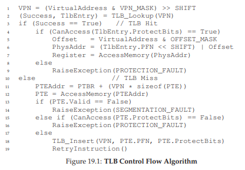
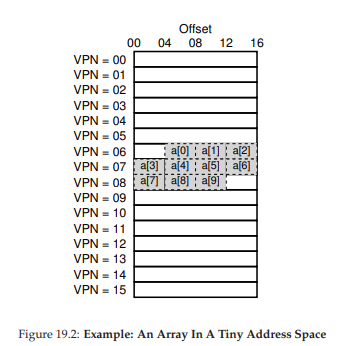

# 페이징: 더 빠른 변환(TLB)

페이징은 성능 저하를 유발할 수 있다. 페이징은 페이징 테이블을 메모리에 저장한다. 저장을 위해 큰 공간이 요구되기도 하지만 가상 주소에서 물리 주소로의 주소 변환을 위한 메모리 읽기 작업은 엄청난 성능 저하를 유발한다.

어떻게 하면 주소 변환을 빨리할 수 있을까? 페이징에서 발생하는 추가 메모리 참조를 피할 수 있을까?

주소 변환을 빠르게 하기 위해 **변환-색인 버퍼(translation-lookaside buffer)** 혹은 **TLB** 를 도입한다. TLB는 **MMU**의 일부다. 자주 참조되는 가상 주소-실주소 변환 정보를 저장하는 캐시로 **주소-변환 캐시(address-translation cache)** 가 더 적합한 명칭이다. 하드웨어는 먼저 TLB에서 변환 정보를 찾을 것이고 있을 경우 페이지 테이블을 거치지 않고 빠르게 변환을 수행한다. 

# TLB의 기본 알고리즘



위의 이미지는 가상 주소 변환이 이루어지는 과정을 대략적으로 나타내고 있다. 

하드웨어 부분의 알고리즘은 다음과 같이 동작한다. 가상주소에서 VPN을 추출한 후 만약 해당 VPN이 TLB에 있다면 **TLB 히트**이고 TLB가 해당 값을 가지고 있는 것을 의미한다. 그렇다면 바로 PFN을 가져오게 된다.

TLB에 변환 정보가 없다면(**TLB 미스**) 할 일이 많다. 하드웨어가 페이지 테이블에 접근하며 가상 메모리 참조가 유효하고 접근 가능하다면 해당 정보를 TLB로 읽어들인다. 매우 시간이 많이 소요되는 작업이다. TLB가 갱신되면 메모리 참조가 빠르게 될 것이다.

# 예제: 배열 접근

TLB의 작동 과정을 더 명확히 알기 위해 C 코드로 작성된 배열 접근을 살펴보겠다.

```c
int sum = 0;
for (i = 0l i < 10; i++) {
    sum += a[i];
}
```



메모리 접근을 단순화 하기 위해 i, sum, 명령어를 위한 메모리 접근은 무시한다. 

다음의 절차로 메모리 접근이 이루어 질 것이다.
1. a[0]에 접근 하기 위해 VPN을 추출하고 TLB에서 검색할 것이다.
2. TLB가 비어있으므로 TLB 미스가 일어난다.
3. 페이지 테이블에 접근해 VPN 06번의 위치를 찾고 TLB를 갱신한다.

다음 a[i]의 위치를 읽을 때에는 좀 더 상황이 좋다. 같은 VPN에 접근한 적이 있을 떄는 TLB에서 찾을 것이고, 만약 없더라도 한 두번의 TLB 미스만 있을 것이다.

배열에는 처음 접근하였지만 같은 VPN 내에 있을 경우에는 **공간 지역성(spatial locality)** 로 인해 성능을 개선할 수 있다. 만약 페이지의 크기가 더 커질 경우에는 TLB 미스가 더욱 줄어들 것이다.

또한 배열을 반복적으로 접근할 경우 성능은 더욱 개선된다. 모든 주소 정보가 TLB에 캐시 되어 있기 때문에 다음에 다시 접근할 때에는 100%의 TLB 히트 비율을 얻을 수 있다. 이는 **시간 지역성(temporal locality)** 에 의한 것이다.

# TLB 미스는 누가 처리할까

두 가지 방법이 있다. 하드웨어와 소프트웨어이다.

CISC를 사용하던 시절, 당시 OS 개발자들의 (꼼수를 쓰기를 좋아하는..)특성 떄문에 그들을 완전히 신뢰할 수 없었다. 그런 이유로 TLB 미스를 하드웨어가 처리하였다. 그로 인해 하드웨어는 페이지 테이블의 메모리상 위치와 정확하 형식을 파악하고 있어야 했다. 

하드웨어는 다음과 같은 일을 하게 된다.
1. 페이지 테이블에서 PTE를 찾는다.
2. 변환 정보를 추출한다.
3. TLB를 갱신한다.
4. TLB 미스가 발생한 명령어를 다시 실행시킨다.

인텔 x86 CPU가 **하드웨어로 관리되는 TLB**의 예다. 또한 x86 CPU는 **멀티 레벨 페이지 테이블(multi-level page table)** 을 사용한다.

RISC는 CISC에 비해 최근에 등장한 컴퓨터 구조이다. 이 RISC 컴퓨터들은 **소프트웨어 관리 TLB** 를 사용한다. 

RISC에서 TLB 미스를 처리하는 과정은 다음과 같다.
1. TLB 미스 발생 시 하드웨어가 예외 시그널을 발생시킨다.
2. OS 프로세스를 커널 모드로 변경한다.
3. 커널 모드가 되면 **트랩 핸들러(trap handler)** 를 실행한다.
4. TLB를 갱신한다.
5. 명령어를 재실행 한다.
   
여기서 트랩 핸들러가 바로 TLB 미스를 처리하는 것이다. 

두가지 짚어볼 것이 있다.

첫번쨰로 TLB 미스를 처리하는 핸들러는 시스템 콜 호출시 사용되는 핸들러와 차이가 있다. TLB 미스를 처리한 핸들러는 다시 명령어를 처리해야 하기 떄문에 발생 원인에 따라 PC 값을 현재 명령어 혹은 다음 명령어로 지정해야 한다.

두번째로 TLB 미스 핸들러를 실행할 때 무한히 TLB 미스가 나는 것을 주의해야 한다. 핸들러를 접근 하는 과정에서 TLB 미스가 나는 상황이다. 이를 해결하기 위해 핸들러를 '물리' 주소로 표시하는 것이다. 이 경우 핸들러는 **unmap** 되어 주소 변환 하지 않는다. 다른 방법으로는 TLB 핸들러의 코드 주소를 메모리에 영구히 할당하는 것이다. 이를 **연결(wired) 변환**이라고 한다.

# TLB 구성

TLB는 일반적으로 32, 64, 또는 128개의 엔트리를 가지며 **완전 연관(fully associative)** 방식으로 설계된다. 완전 연관 방식에서 변환 정보는 TLB내에 어디든지 위치할 수 있다. 구성은 다음과 같다.

`VPN | PFN | 다른 비트들`

변환 정보를 위해 VPN과 PFN이 존재하고, 다른 비트들로는 **protection bit, valid bit, 주소 공간 식별자(address-space identifier), 더티 비트(dirty bit)** 등이 있다.

# TLB의 문제

TLB를 사용하게 되면 문맥 교환 시 새로운 문제가 발생한다. TLB의 정보는 그것을 탑재시킨 프로세스에서만 유효한데, 다른 프로세스가 이 정보를 사용해서는 안된다. 예를 들어 서로 다른 프로세스가 VPN10을 가지고 있다고 하더라도 실제로 PFN은 다를 수 있다.

이에는 여러 가지 해법이 있을 수 있다. 하나는 문맥 교환을 수행할 때 TLB의 내용을 비우는 것이다. 하지만 이 방법은 비용이 큰데, 새로운 프로세스가 실행될 떄마다 TLB 미스가 계속해서 발생할 것이기 때문이다. 

이 부담을 개선하기 위해 몇몇 시스템에서는 TLB에 **주소 공간 식별자(addresss space identifier, ASID)** 를 추가하였다. 이는 PID와 대략적으로 유사하지만 더 적은 비트를 갖고 있다.

# 이슈: 교체 정책

모든 캐시가 그러하듯이 TLB도 **캐시 교체(cache replacement)** 정책이 매우 중요하다. 

가장 흔한 방법 중 하나로 **최저 사용 빈도(least-recently-used, LRU)** 항복을 교체하는 것이다. LRU는 메모리 참조 패턴에서 지역성을 최대한 활용하는 것이 목적이다.

또 하나의 방법으로 랜덤(random) 정책이다. 이 정책은 무작위로 교체 대상을 정하는데 떄떄로 잘못된 결정을 내릴 수 있다. 하지만 이 정책은 구현이 간단하고 예상치 못한 예외 상황의 발생을 피할 수 있다는 장점이 있다. 예를 들어 LRU와 같은 "합리적인 정책은" n개의 변환 정보를 저장할 수 있는 TLB가 n + 1 페이지들에 대해 반복문을 수행할 경우 계속해서 TLB 미스를 발생시킬 것이다. 그에 반해 랜덤의 경우는 그것보다는 잘 작동할 것이다.
